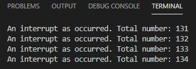

# Práctica 2B: Interrupción por timer

## CÓDIGO:

```
#include <Arduino.h>

volatile int interruptCounter;
int totalInterruptCounter;
 
hw_timer_t * timer = NULL;
portMUX_TYPE timerMux = portMUX_INITIALIZER_UNLOCKED;
 
void IRAM_ATTR onTimer() {
  portENTER_CRITICAL_ISR(&timerMux);
  interruptCounter++;
  portEXIT_CRITICAL_ISR(&timerMux);
 
}
 
void setup() {
 
  Serial.begin(115200);
 
  timer = timerBegin(0, 80, true);
  timerAttachInterrupt(timer, &onTimer, true);
  timerAlarmWrite(timer, 1000000, true);
  timerAlarmEnable(timer);
 
}
 
void loop() {
 
  if (interruptCounter > 0) {
 
    portENTER_CRITICAL(&timerMux);
    interruptCounter--;
    portEXIT_CRITICAL(&timerMux);
 
    totalInterruptCounter++;
 
    Serial.print("An interrupt as occurred. Total number: ");
    Serial.println(totalInterruptCounter);
  }
}

```

## FUNCIONAMINETO:
Este caso, el código hace una interrupcion por timer, que conisiste en que al cabo de cierto tiempo, se ejecutara una interrupión, en este caso la interrupción no se relizará manualmente sinó que el propio programa se encargará de ejecutarlo.

Este código esta programado para que cada segundo se provoque una interrupción, y cada vez que se produce el programa muesta por pantalla un mesaje donde indica el se ha producido una interrupción y quantas interrupciones ha hecho, las cuales van incrementando de una en una. 
```
if (interruptCounter > 0) {
 
    portENTER_CRITICAL(&timerMux);
    interruptCounter--;
    portEXIT_CRITICAL(&timerMux);
 
    totalInterruptCounter++;
 
    Serial.print("An interrupt as occurred. Total number: ");
    Serial.println(totalInterruptCounter);
  }
```
El muestreo por pantalla queda de la siguiente forma:


